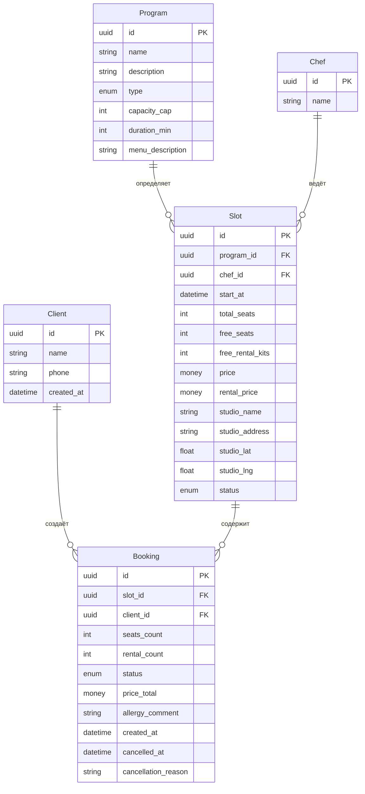
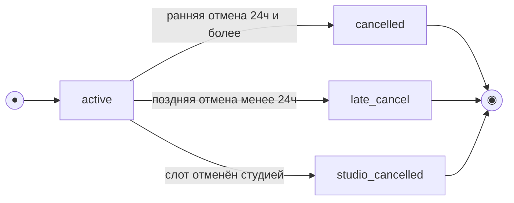
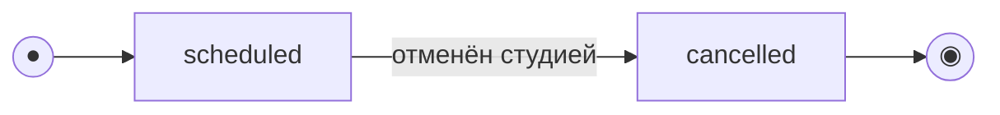

# Модель данных

> Этап 3. Проектирование. Описание сущностей, атрибутов и связей + черновик ERD.
>
> **Скоуп: клиентское приложение и API для него.** Это **ресурсная модель API** (что клиент
> читает/создаёт), а не схема БД, которую мы проектируем: хранение и бизнес-логика принадлежат
> **существующей инфраструктуре**.
>
> - **Program, Chef, Slot** — read-only-проекция ресурсов существующего бэкенда; приходят
>   через API, клиент их не создаёт и не редактирует.
> - **Client, Booking** — ресурсы, которыми оперирует клиентский API (регистрация и бронирования).
> - Сущности оценок/рейтингов в скоуп не входят (Phase 2, согласовано с заказчиком).
> - **Данные существующей инфраструктуры (R-015).** Проект учебный/тестовый, легаси-данных нет:
>   эта модель (вместе с `rental_price`, `studio_address`, `free_rental_kits`)
>   считается **канонической** и совпадает с контрактом API. Миграция/backfill и поведение при
>   отсутствии полей не рассматриваются — бэкенд по условию отдаёт все поля модели.

---

## Сущности и атрибуты

### Client (Клиент)

| Атрибут | Тип | Описание |
| :-- | :-- | :-- |
| id | UUID (PK) | Идентификатор клиента |
| name | string | Имя |
| phone | string (unique) | Номер телефона — логин; вход подтверждается кодом из SMS (OTP) |
| created_at | datetime | Дата регистрации |

> Вход/регистрация — трёхшаговый поток (телефон → код из SMS → имя для нового пользователя),
> см. [SCR-001](../3-design-brief/SCR-001-registration.md). Сам код подтверждения (OTP) и его
> проверка — на стороне бэкенда, отдельной сущностью в модели не хранится. Смена телефона в
> профиле также подтверждается кодом.

> **История броней и удаление аккаунта (R-025).** Клиенту доступна **вся история** своих
> броней (активные, отменённые, поздние, отменённые студией, прошедшие) — `listBookings`
> отдаёт её **постранично** (пагинация, `limit`/`offset`).
>
> **Переход состояний при `deleteAccount` (R-006).** При удалении аккаунта:
> - **Активные брони** (`status = active`) переводятся в `cancelled` (системная отмена):
>   проставляется `cancelled_at`, **освобождаются места и прокатные комплекты** в слоте — как при
>   обычной ранней отмене (`free_seats += seats_count`, `free_rental_kits += rental_count`).
> - **Прошедшие / завершённые брони** сохраняются обезличенными (для учёта).
> - **ПДн клиента** (`name`, `phone`) **анонимизируются**, а не удаляются жёстко; `Client.phone`
>   **освобождается** для повторной регистрации.
> - **История** связанных броней **сохраняется обезличенной** (для учёта/статистики
>   существующей инфраструктуры).

---

### Program (Программа) — справочник, read-only

| Атрибут | Тип | Описание |
| :-- | :-- | :-- |
| id | UUID (PK) | Идентификатор программы |
| name | string | Название (например, «Итальянская кухня», «Японская кухня») |
| description | string? (nullable) | Описательный текст программы/меню для карточки слота (SCR-003). Опциональный; может отсутствовать или быть `null` |
| type | enum (`simple`/`complex`) | Тип: простая / сложная (с духовкой, сувидом и прочей техникой) |
| capacity_cap | int | Потолок мест: простая — 12, сложная — 8 |
| duration_min | int | Длительность, мин (~180) |
| menu_description | string | Краткое описание блюд, которые готовятся на классе |

---

### Chef (Шеф) — справочник, read-only

| Атрибут | Тип | Описание |
| :-- | :-- | :-- |
| id | UUID (PK) | Идентификатор шефа |
| name | string | Имя шефа |

---

### Slot (Слот / класс) — предзаполняется, read-only для клиента

| Атрибут | Тип | Описание |
| :-- | :-- | :-- |
| id | UUID (PK) | Идентификатор слота |
| program_id | FK → Program | Программа (меню) |
| chef_id | FK → Chef | Назначенный шеф |
| start_at | datetime (UTC) | Дата и время старта в UTC; **хранится в UTC**, **источник истины — сервер**. Клиент отображает в **локальной зоне**, но право/тип отмены (правило 24 часов) вычисляет сервер (R-021) |
| total_seats | int | Всего мест (≤ capacity_cap программы) |
| free_seats | int | Свободно мест (расчётное/денормализованное) |
| free_rental_kits | int | Свободно прокатных комплектов экипировки (из общих 12) |
| price | money (RUB) | Цена за место (валюта — рубли) |
| rental_price | money (RUB) | **Отдельный тариф проката** за один прокатный комплект экипировки (отдельно от `price`); своя экипировка бесплатна. Итог брони = `price × seats_count + rental_price × rental_count`. Валюта — рубли (R-010) |
| studio_name | string | Название студии (например, «Шеф-стол») |
| studio_address | string | **Адрес студии** — обязательный; текстовый блок на SCR-003/SCR-006 |
| studio_lat | float | Широта студии — метка на карте |
| studio_lng | float | Долгота студии — метка на карте |
| status | enum (`scheduled`/`cancelled`) | Статус слота |

---

### Booking (Запись / бронь)

| Атрибут | Тип | Описание |
| :-- | :-- | :-- |
| id | UUID (PK) | Идентификатор записи |
| slot_id | FK → Slot | Слот |
| client_id | FK → Client | Кто записал |
| seats_count | int | Число мест в записи (1–3: себя + гости). Только агрегат, без сущности BookingSeat (R-013) |
| rental_count | int | Сколько из мест — на прокатной экипировке (0..seats_count). Агрегат, без BookingSeat (R-013) |
| status | enum (`active`/`cancelled`/`late_cancel`/`studio_cancelled`) | Статус записи. `studio_cancelled` — **«Отменена студией»**: возникает, когда слот отменён студией (`Slot.status = cancelled`); клиент видит бронь как отменённую не по своей инициативе (R-008) |
| price_total | money (RUB), read-only | **Итоговая цена, рассчитанная и возвращаемая сервером** (read-only). Клиент использует её как есть и **не пересчитывает**; `price`/`rental_price` лежат в связанном `slot`. Цена **фиксируется на момент брони** (R-005, R-010) |
| allergy_comment | string? (nullable) | Комментарий к записи: аллергии и особенности питания. Свободное текстовое поле до ~500 символов (FR-50) |
| created_at | datetime | Время создания |
| cancelled_at | datetime? | Время отмены (если была) |
| cancellation_reason | string? (nullable) | Причина отмены студией (заполняется только для `studio_cancelled`) |

> Примечание: по гостям хранятся **только** агрегаты `seats_count` и `rental_count` — отдельной
> сущности `BookingSeat` (вариант экипировки/имя по каждому гостю) в скоупе **нет** (R-013).
> Вариант экипировки выводится из `rental_count` (прокатные места) и `seats_count − rental_count`
> (своя экипировка).

> **Итоговая цена `price_total` рассчитывается на сервере и приходит в ответе API как read-only**
> (R-005). Клиент **не пересчитывает** её, а отображает; исходные тарифы `price`/`rental_price`
> лежат в связанном `slot`. Расчёт сервера: `price × seats_count + rental_price × rental_count`,
> валюта — рубли; **цена фиксируется на момент создания брони** (R-010). SCR-005/SCR-006 показывают
> `price_total`.

> **«Прошедшая» — не хранимый статус.** Бейдж «Прошедшая» (SCR-006) и группа «Прошедшие»
> (SCR-005) — **производное отображение** по `Slot.start_at` в прошлом, а не значение
> `Booking.status`. Статус остаётся `active`/`cancelled`/`late_cancel`; «прошедшесть»
> вычисляется из времени старта. См. [модель состояний](#модель-состояний-жизненный-цикл).

> Статусы `no_show` и сущности оценок (`Rating`) в скоуп клиентского приложения не входят —
> относятся к существующей инфраструктуре (отметка явки / «класс состоялся») и Phase 2.

> Карта студии: `Slot.studio_address` + координаты задают метку и текст адреса (см. [SCR-003](../3-design-brief/SCR-003-slot-card.md),
> [SCR-006](../3-design-brief/SCR-006-booking-details.md) и
> [foundations §4.5](../3-design-brief/00-foundations.md#45-карта-адреса-студии-яндекскарты)).
> Источник тайлов и ключ Яндекс.Карт (Static API / Maps JS API) — параметр конфигурации, в модель не входит.

---

## ERD

---

## Модель состояний (жизненный цикл)

> Две сущности имеют явный жизненный цикл: **Booking** (управляется клиентским API) и
> **Slot** (read-only-проекция; переходы выполняет существующая инфраструктура, клиент только
> читает текущий статус). Состояние **«Прошедшая»** у обеих — **производное** (вычисляется по
> `Slot.start_at` относительно текущего времени), а не отдельное значение enum.

---

### Booking (Запись / бронь)

`status ∈ {active, cancelled, late_cancel, studio_cancelled}`. Создаётся в `active`; отмена —
терминальный переход (повторная отмена не выполняется, [UC-2 E2](../2-requirements/use-cases.md)).
Какой именно переход (ранняя/поздняя отмена) — определяется **сервером** по времени до старта на
момент отмены (`slot.start_at` в UTC — источник истины); граница «ровно 24 часа» трактуется как
**ранняя** (`≥ 24 ч`, см. [foundations §6](../3-design-brief/00-foundations.md#6-tone-of-voice-и-общая-микрокопия), R-021).
Отдельно: при отмене **слота студией** (`Slot.status → cancelled`) связанные брони переходят в
`studio_cancelled` — **«Отменена студией»** (отмена не по инициативе клиента, R-008); места/экипировка
в слоте при этом не релевантны (слот снят).

> «Прошедшая» — производное отображение (`slot.start_at` в прошлом), не отдельный статус;
> отмена недоступна после старта (UC-2 E1). Трасса переходов — в таблице ниже.

| Из | Событие / условие | В | Эффект на слот | Трасса |
| :-- | :-- | :-- | :-- | :-- |
| — | Клиент подтверждает бронь | `active` | `free_seats −= seats_count`; `free_rental_kits −= rental_count` | UC-1, FR-10 |
| `active` | Отмена, до старта `≥ 24 ч` | `cancelled` | Места и прокатные комплекты **возвращаются** в слот | UC-2, FR-17 |
| `active` | Отмена, до старта `< 24 ч` | `late_cancel` | Место и прокатные комплекты **НЕ освобождаются**, штрафов нет | UC-2 A1, FR-18 |
| `active` | Слот отменён студией (`Slot.status → cancelled`) | `studio_cancelled` | Слот снят; клиент уведомляется (push), запись закрыта не по своей инициативе | R-008, FR-33, FR-46 |
| `cancelled` / `late_cancel` / `studio_cancelled` | — (терминальные) | — | Повторная отмена не выполняется | UC-2 E2 |

> Отмена возможна только пока класс не начался (`start_at` в будущем) — после старта CTA
> недоступна ([SCR-006 §6.3](../3-design-brief/SCR-006-booking-details.md), UC-2 E1). Статус
> `no_show` (неявка) — вне скоупа клиентского приложения (существующая инфраструктура).

---

### Slot (Класс / слот)

`status ∈ {scheduled, cancelled}` — read-only для клиента. Переход в `cancelled` инициирует
владелец/администратор в существующей инфраструктуре (массовое уведомление участников — вне скоупа
клиента, [FR-33, FR-46](../2-requirements/functional-requirements.md)). Клиент видит статус и реагирует
на UI: при `cancelled` запись недоступна ([SCR-003 §7](../3-design-brief/SCR-003-slot-card.md)).

> «Прошедшая» — производное (`start_at` в прошлом). Отметка явки / «класс состоялся» — вне
> скоупа клиента (существующая инфраструктура).

| Статус | Что видит клиент | Запись |
| :-- | :-- | :-- |
| `scheduled` (старт в будущем) | Слот в списке/карточке; при `free_seats = 0` — пометка «Мест нет» | Доступна при `free_seats > 0` |
| `scheduled` (старт в прошлом) — *производное «Прошедшая»* | В клиентских сценариях не предлагается к записи | Недоступна |
| `cancelled` | Пометка «Класс отменён» / «Слот недоступен» с причиной (если есть) | Недоступна / скрыта |

---

## Ключевые инварианты (целостность данных)

- `Slot.free_seats = Slot.total_seats − Σ(active+late_cancel bookings.seats_count)` — место при поздней отмене НЕ освобождается.
- `Slot.total_seats ≤ Program.capacity_cap` (простая ≤12, сложная ≤8).
- `Slot.free_rental_kits = исходный прокатный фонд слота − Σ(active+late_cancel bookings.rental_count)` — прокатный комплект при поздней отмене тоже НЕ освобождается; общий прокатный фонд студии — 12 комплектов (фартук + ножи).
- Только **ранняя** отмена возвращает места и прокатные комплекты в слот (`cancelled`); `late_cancel` удерживает и место, и экипировку (FR-17/FR-18).
- Запись/отмена выполняются атомарно: овербукинг и двойная бронь исключены при параллельных операциях (NFR-8, NFR-9).
- `seats_count` в одной брони — от 1 до 3 (себя + до 2 гостей) (FR-12).
- `rental_count` ≤ `seats_count` (нельзя взять в прокат больше мест, чем забронировано).
- При `free_rental_kits = 0` запись возможна **только со своей экипировкой**.

---

## Глоссарий

| Термин | Определение |
| :-- | :-- |
| **Класс / Слот** | Конкретное занятие: дата/время старта, программа (меню), шеф, всего и свободно мест. |
| **Программа** | Вариант класса: простая (до 12 человек) или сложная, с духовкой/техникой (до 8 человек). |
| **Шеф** | Ведёт класс. |
| **Рабочий стол** | Часть инвентаря студии; всего 12; определяет физический лимит группы. |
| **Экипировка** | Фартук + набор ножей из прокатного фонда студии (всего 12 комплектов). |
| **Своя экипировка** | Клиент приходит со своим фартуком и ножами; занимает место, но не расходует прокатный фонд. |
| **Запись (бронь)** | Резерв одного или нескольких мест на конкретный слот: число мест, своя/прокатная экипировка, комментарий (аллергии), статус. |
| **Ранняя отмена** | Отмена ≥ 24 ч до старта: места и прокатные комплекты возвращаются. |
| **Поздняя отмена** | Отмена < 24 ч до старта: места не освобождаются, штрафов нет. |
| **Отмена студией** | Отмена класса организатором (срыв поставки, поломка оборудования) — бронь переходит в статус `studio_cancelled` с причиной. |
