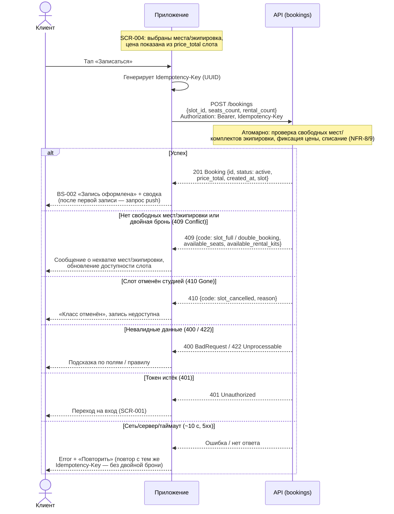
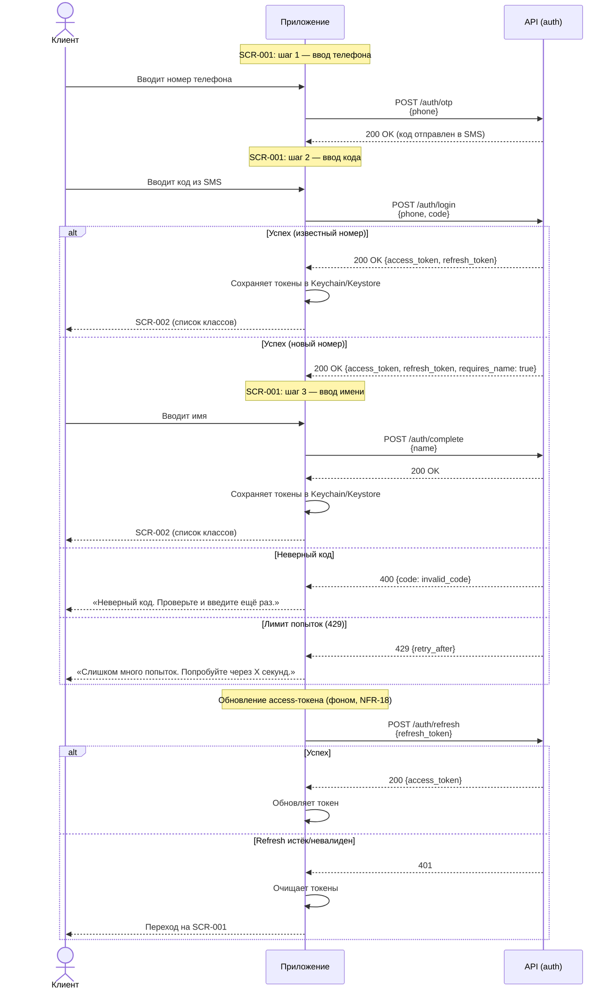
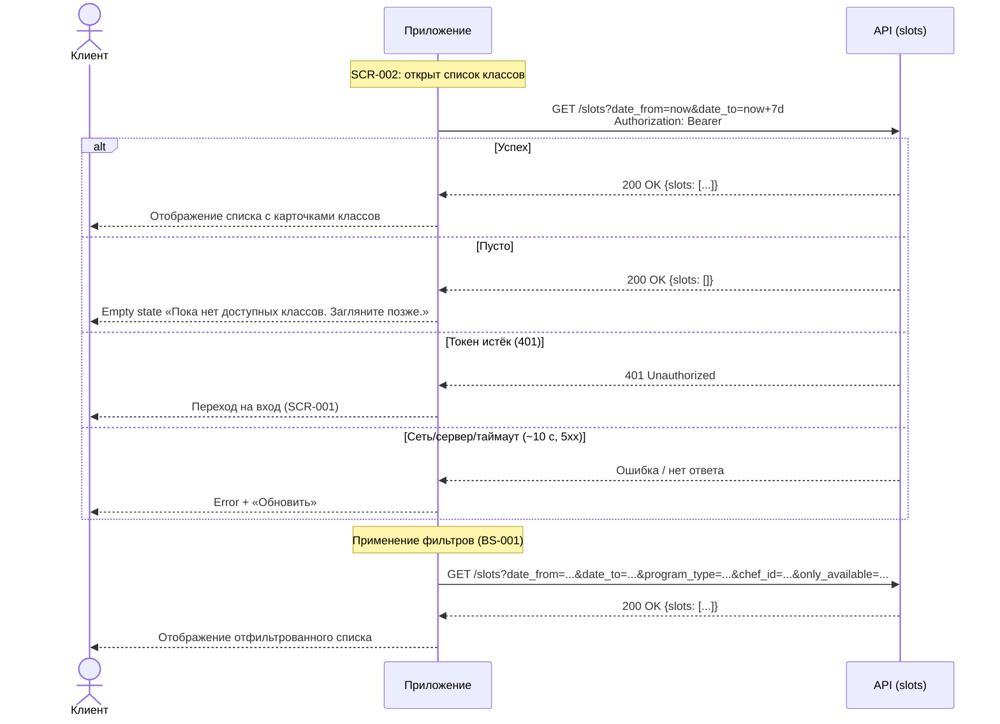
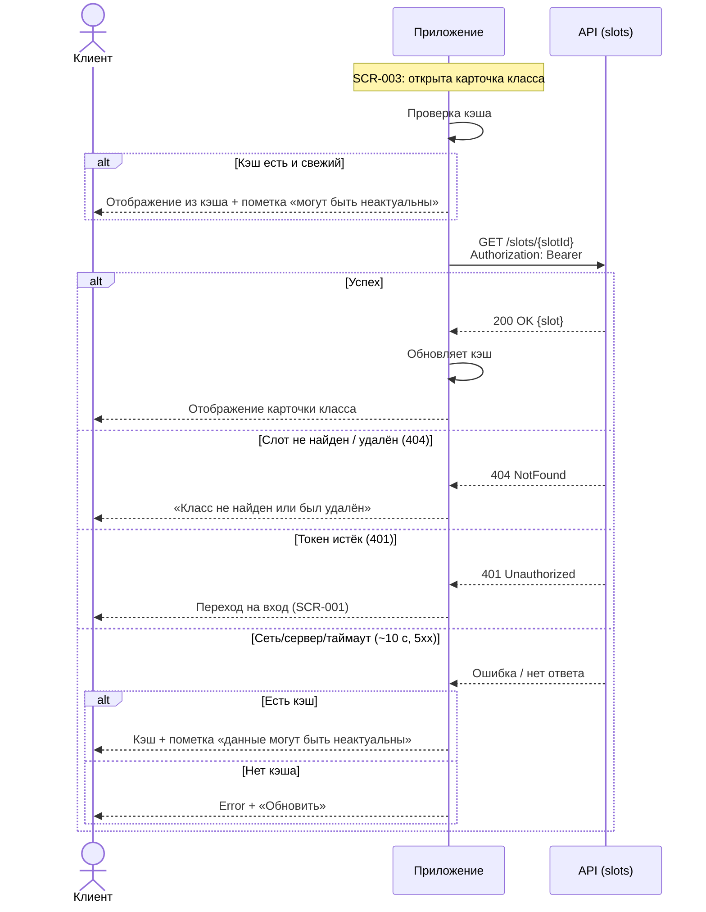
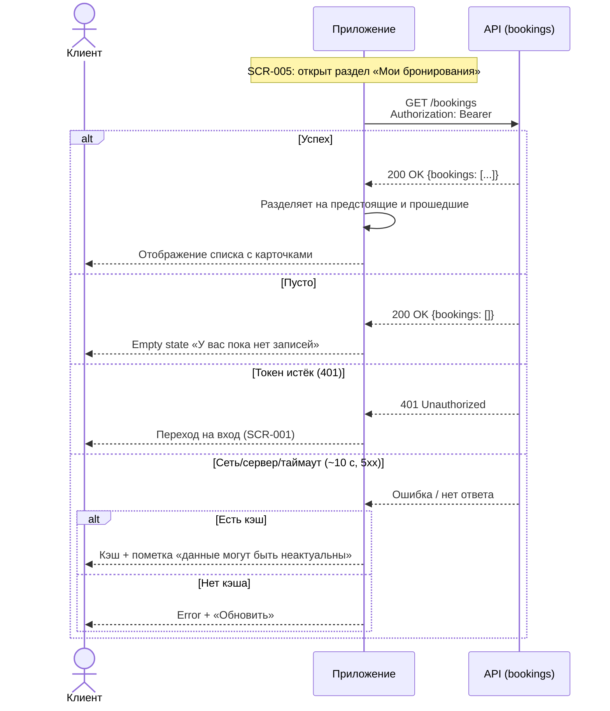
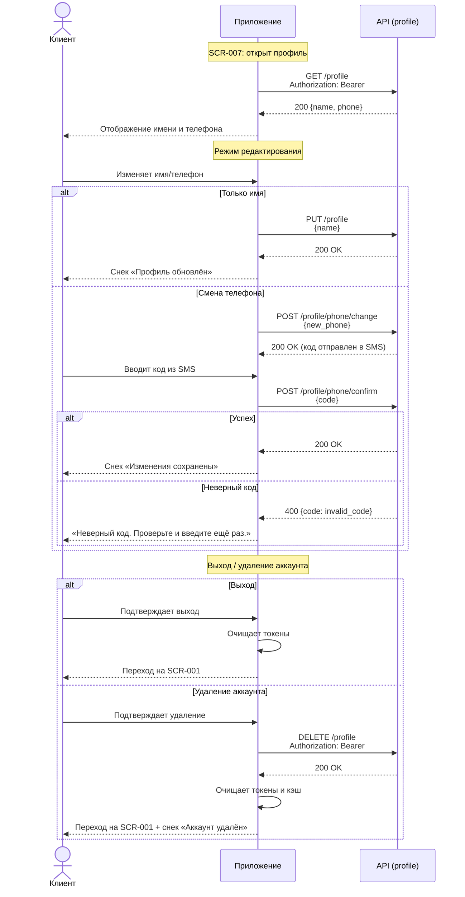

# Sequence-диаграмма API-взаимодействия

> Этап 3. Проектирование. Как клиент и сервер обмениваются вызовами в критичных сценариях
> бронирования. Контракты API — в многофайловой спецификации
> [api/redocly.yaml](../api/redocly.yaml) (домены `bookings`, `slots`, `auth`).
> Операции: `createBooking`, `cancelBooking` ([bookings/api.yaml](../api/bookings/api.yaml)).

> **Сквозные правила взаимодействия.**
> - Все вызовы — с `Authorization: Bearer <token>` (`bearerAuth`); при истёкшем/неверном токене
>   сервер отвечает `401`, клиент уходит на вход [SCR-001](../3-design-brief/SCR-001-registration.md).
> - Сервер — **источник истины** по времени и доступности: `slot.start_at` в UTC, тип отмены и
>   наличие мест/экипировки проверяет сервер, клиент их не пересчитывает (R-005, R-021).
> - Запись/отмена **атомарны**: овербукинг и двойная бронь исключены (NFR-8, NFR-9).
> - Таймаут запроса ~10 с; мутации офлайн запрещены — см. единый паттерн Error/Retry (R-020).

---

## Сценарий 1: Создание брони (`createBooking`, UC-1)

Поток: [SCR-004 «Оформление записи»](../3-design-brief/SCR-004-booking.md) → `POST /bookings`
→ [BS-002 «Подтверждение»](../3-design-brief/BS-002-booking-success.md). Клиент отправляет
`slot_id`, `seats_count` (1..3) и `rental_count` (0..seats_count). Итоговую цену `price_total`
(RUB, read-only) считает сервер — клиент её не вычисляет, а показывает (R-005, R-010).



| Шаг | Что происходит | Источник |
| :-- | :-- | :-- |
| Запрос | `POST /bookings` с `Idempotency-Key`; тело — `CreateBookingRequest` | bookings/api.yaml |
| Проверка | Сервер атомарно проверяет места/прокатную экипировку и фиксирует цену слота | NFR-8/9, R-010 |
| `201` | Возвращается `Booking` со `status=active` и `price_total` (read-only) | R-005 |
| `409` | Нет мест/экипировки или двойная бронь; тело несёт `available_seats`/`available_rental_kits` (Error.details) | common/models.yaml |
| `410` | Слот отменён студией (`slot_cancelled`) с причиной | R-008 |
| Повтор | Сетевой сбой → повтор с тем же `Idempotency-Key` исключает дубль | NFR-9, R-020 |

---

## Сценарий 2: Отмена брони (`cancelBooking`, UC-2)

Поток: [SCR-006 «Детали брони»](../3-design-brief/SCR-006-booking-details.md) →
[BS-003 «Подтверждение отмены»](../3-design-brief/BS-003-cancel-confirm.md) → `POST
/bookings/{bookingId}/cancel`. Отмена — **только целиком** (R-014). **Тип отмены определяет
сервер** по времени до старта (источник истины — `slot.start_at` в UTC): `≥ 24 ч` → `cancelled`
(места и прокатные комплекты возвращаются в слот), `< 24 ч` → `late_cancel` (не возвращаются, штрафов
нет). Граница «ровно 24 часа» трактуется как ранняя отмена (R-021).

```mermaid
sequenceDiagram
    actor User as Клиент
    participant App as Приложение
    participant API as API (bookings)

    Note over App: SCR-006: бронь active, старт в будущем
    User->>App: Тап «Отменить запись»
    App-->>User: BS-003 «Подтверждение отмены»<br/>(текст правила 24 часов)
    User->>App: Подтверждает отмену (целиком)

    App->>API: POST /bookings/{bookingId}/cancel<br/>Authorization: Bearer
    Note over API: Сервер по slot.start_at (UTC) выбирает<br/>тип отмены; граница ровно 24ч = ранняя

    alt Ранняя отмена (≥ 24 ч)
        API-->>App: 200 Booking {status: cancelled, cancelled_at}
        App-->>User: SCR-006 + снек «Бронь отменена»<br/>(места/экипировка вернулись в слот)
    else Поздняя отмена (< 24 ч)
        API-->>App: 200 Booking {status: late_cancel, cancelled_at}
        App-->>User: SCR-006 + «Поздняя отмена: место не<br/>освобождено. Штраф не взимается.»
    else Слот уже стартовал (422 Unprocessable)
        API-->>App: 422 {code: slot_started}
        App-->>User: Отмена недоступна после старта
    else Уже отменена (409 Conflict)
        API-->>App: 409 {code: already_cancelled}
        App-->>User: Бронь уже отменена, статус актуализируется
    else Чужая/несуществующая бронь (403 / 404)
        API-->>App: 403 Forbidden / 404 NotFound
        App-->>User: Бронь недоступна
    else Токен истёк (401)
        API-->>App: 401 Unauthorized
        App-->>User: Переход на вход (SCR-001)
    else Сеть/сервер/таймаут (~10 c, 5xx)
        API-->>App: Ошибка / нет ответа
        App-->>User: Снек ошибки на BS-003, шторка остаётся<br/>открытой — можно повторить
    end
```

| Шаг | Что происходит | Источник |
| :-- | :-- | :-- |
| Запрос | `POST /bookings/{bookingId}/cancel` (без тела; отмена целиком) | R-014, bookings/api.yaml |
| Решение | Сервер выбирает `cancelled` / `late_cancel` по `start_at` (UTC) | R-021 |
| `200` | `Booking` с новым `status` и `cancelled_at`; экран обновляется | модель данных |
| `422` | Слот уже стартовал (`slot_started`) — отмена недоступна | UC-2 E1 |
| `409` | Повторная отмена (`already_cancelled`) — терминальный статус | UC-2 E2 |

> Полная модель состояний брони и инварианты освобождения мест/экипировки —
> в [data-model.md §«Модель состояний»](../../../../mimo-kassy-backend/app/models/data-model.md#модель-состояний-жизненный-цикл).

---

## Сценарий 3: Авторизация и обновление токена (Auth)

Поток: [SCR-001 «Регистрация / Вход»](../3-design-brief/SCR-001-registration.md) ↔ `POST /auth/otp`
и `POST /auth/login` → получение JWT-токенов (access + refresh). Сессия поддерживается парой
токенов (NFR-18): короткоживущий access (~15 мин) и долгоживущий refresh (~30 дней). Access
автоматически обновляется по refresh без участия пользователя; перелогин (OTP-вход) требуется
только при истечении/отзыве refresh.



| Шаг | Что происходит | Источник |
| :-- | :-- | :-- |
| Запрос OTP | `POST /auth/otp` с номером телефона | auth/api.yaml |
| Логин | `POST /auth/login` с номером и кодом; возвращает access + refresh | NFR-18 |
| Дополнение профиля | `POST /auth/complete` с именем (только для новых пользователей) | FR-1 |
| Обновление | `POST /auth/refresh` с refresh-токеном (фоном, при 401 от API) | NFR-18 |
| Хранилище | Токены хранятся в Keychain (iOS) / Keystore (Android), не в незащищённом storage | NFR-4, NFR-18 |

---

## Сценарий 4: Получение списка слотов (`listSlots`, UC-3)

Поток: [SCR-002 «Список классов»](../3-design-brief/SCR-002-slot-list.md) → `GET /slots`
→ отображение списка. По умолчанию показываются слоты на ближайшие 7 дней (`date_from=now`,
`date_to=now+7d`), отсортированные по времени старта. Фильтры применяются через параметры
запроса (FR-38, R-027).



| Шаг | Что происходит | Источник |
| :-- | :-- | :-- |
| Запрос | `GET /slots` с параметрами фильтрации | slots/api.yaml |
| Дефолт | `date_from=now`, `date_to=now+7d`, `only_available=false` | R-027, FR-9 |
| Фильтрация | Параметры: дата/период, тип программы, шеф, только свободные | FR-38 |
| `200` | Возвращается массив `Slot` с полями слота, программы и шефа | модель данных |

---

## Сценарий 5: Получение деталей слота (`getSlot`, SCR-003)

Поток: [SCR-003 «Карточка класса»](../3-design-brief/SCR-003-slot-card.md) → `GET /slots/{slotId}`
→ отображение всех параметров класса. Кэширование на клиенте разрешено (R-020): при наличии
кэша показываются данные с пометкой «могут быть неактуальны»; при offline-режиме кэш остаётся
доступен.



| Шаг | Что происходит | Источник |
| :-- | :-- | :-- |
| Запрос | `GET /slots/{slotId}` | slots/api.yaml |
| Кэширование | Просмотр кэша офлайн разрешён с пометкой устаревания | R-020, NFR-24 |
| `200` | Возвращается полный объект `Slot` с программой, шефом и адресом студии | модель данных |

---

## Сценарий 6: Получение списка броней (`listBookings`, SCR-005)

Поток: [SCR-005 «Мои бронирования»](../3-design-brief/SCR-005-my-bookings.md) → `GET /bookings`
→ отображение предстоящих и прошедших записей. Разделение на предстоящие/прошедшие выполняется
на клиенте (FR-35a): активные записи с будущим стартом → «Предстоящие»; все остальные →
«Прошедшие».



| Шаг | Что происходит | Источник |
| :-- | :-- | :-- |
| Запрос | `GET /bookings` | bookings/api.yaml |
| Разделение | На клиенте: `active` + `start_at` в будущем → «Предстоящие»; иначе → «Прошедшие» | FR-35a |
| `200` | Возвращается массив `Booking` с вложенными `slot`, `program`, `chef` | модель данных |

---

## Сценарий 7: Управление профилем (SCR-007)

Поток: [SCR-007 «Профиль клиента»](../3-design-brief/SCR-007-profile.md) ↔ `GET /profile`,
`PUT /profile`, `DELETE /profile`, `POST /profile/phone/confirm`. Смена телефона требует
подтверждения кодом из SMS (аналогично входу).



| Шаг | Что происходит | Источник |
| :-- | :-- | :-- |
| Получение | `GET /profile` — данные текущего клиента | profile/api.yaml |
| Обновление | `PUT /profile` — изменение имени и/или телефона | FR-47 |
| Смена телефона | Двухшаговый процесс: `POST /profile/phone/change` → код → `POST /profile/phone/confirm` | NFR-18 |
| Выход | Очистка токенов на клиенте (без вызова API) | FR-49 |
| Удаление | `DELETE /profile` — удаление аккаунта и анонимизация броней | FR-48, NFR-20 |

---

## Матрица ошибок ключевых операций (R-023)

Канон таксономии — коды API. Источник локализованного текста — клиентское приложение.

| Код HTTP | Код ошибки | Обязательные `details` | UX-реакция | Retry |
| :--- | :--- | :--- | :--- | :--- |
| 409 | `slot_full` | `available_seats`, `available_rental_kits` | Показать актуальные свободные места/комплекты, обновить карточку | Нет (изменить число мест) |
| 409 | `double_booking` | `booking_id` | Сообщить, что бронь на слот уже есть; перейти в «Мои бронирования» | Нет |
| 410 | `slot_cancelled` | `slot_id`, `reason` | Сообщить об отмене слота студией, убрать CTA записи | Нет |
| 422 | `slot_started` | `slot_id`, `start_at` | Сообщить, что класс начался/прошёл, запись недоступна | Нет |
| 400 | `invalid_code` | — | «Неверный код», поле OTP остаётся активным | Да (ввод заново) |
| 401 | `unauthorized` | — | Очистка токена, переход на авторизацию | Да (после входа) |
| 403 | `forbidden` | — | Сообщение об отсутствии прав; действие недоступно | Нет |
| 429 | `rate_limit` | `retry_after` | «Слишком много попыток», отложенный повтор | Да (после `retry_after`) |
| 5xx | `server_error` | — | Единый Error/Retry; для брони — повтор по тому же Idempotency-Key | Да |
