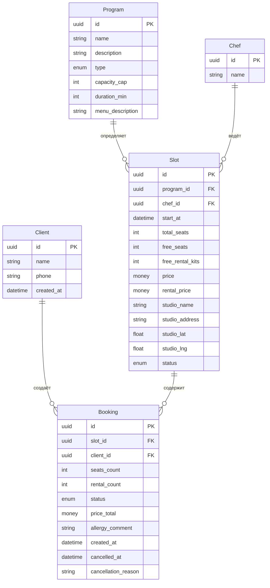
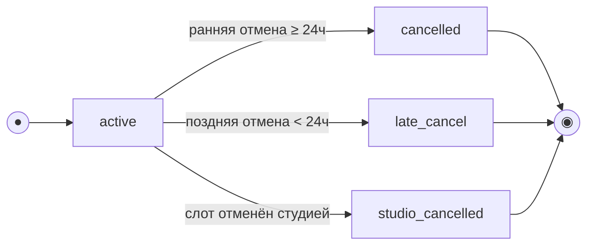

# Бриф для бэкенда

## Приложение «Мимо Кассы» — запись на кулинарные классы

**Версия:** 1.0
**Дата:** 2026-07-05
**Проект:** Клиентское мобильное приложение для кулинарной студии «Шеф-стол»

---

## 1. Цель и контекст

**«Мимо Кассы»** заменяет ручную запись на кулинарные классы через WhatsApp и Google-таблицу, устраняя двойные брони и путаницу с местами.

**Бизнес-цель:** дать клиентам возможность самостоятельно записываться на кулинарные классы онлайн, исключив ручное посредничество владельца.

**Скоуп API:** только клиентский сценарий (роль «Клиент»). Шефы и владелец работают через существующую инфраструктуру/админку.

**Ключевые метрики успеха:**
- Доля онлайн-записей ≥ 70% к концу сезона
- Нулевое количество двойных броней
- Запуск к началу сезона (~2 месяца)

---

## 2. Бизнес-ограничения

| Ограничение | Значение |
|-------------|----------|
| **Рабочие столы в студии** | 12 |
| **Потолок группы (простая программа)** | 12 человек |
| **Потолок группы (сложная программа)** | 8 человек |
| **Прокатная экипировка** | 12 комплектов (фартук + ножи) |
| **Максимум мест в одной брони** | 3 (себя + до 2 гостей) |
| **Правило отмены** | ≥ 24 ч до старта — ранняя (места возвращаются); < 24 ч — поздняя (место не освобождается, штрафов нет) |
| **Оплата** | Только офлайн (наличные / перевод на карту) |
| **Валюта** | RUB |

> **Граница 24 часов:** ровно 24 часа до старта включительно считается **ранней** отменой.

---

## 3. Роли и их задачи

| Роль | В приложении | В API |
|------|--------------|-------|
| **Клиент** | Просмотр слотов, запись, отмена, профиль | Регистрация/вход, работа с бронями и слотами |
| **Шеф** | Не входит в приложение | Не входит в скоуп API |
| **Владелец/Администратор** | Не входит в приложение | Не входит в скоуп API |

---

## 4. Модель данных

### 4.1 ERD



### 4.2 Сущности и атрибуты

#### Client (Клиент)

| Атрибут | Тип | Описание |
|---------|-----|----------|
| `id` | UUID (PK) | Идентификатор клиента |
| `name` | string | Имя клиента |
| `phone` | string (unique) | Номер телефона — логин |
| `created_at` | datetime | Дата регистрации |

#### Program (Программа) — read-only, справочник

| Атрибут | Тип | Описание |
|---------|-----|----------|
| `id` | UUID (PK) | Идентификатор программы |
| `name` | string | Название (например, «Итальянская кухня») |
| `description` | string? | Описание программы |
| `type` | enum (`simple`/`complex`) | Простая / сложная |
| `capacity_cap` | int | Потолок мест (12 / 8) |
| `duration_min` | int | Длительность (мин) |
| `menu_description` | string | Краткое описание меню |

#### Chef (Шеф) — read-only, справочник

| Атрибут | Тип | Описание |
|---------|-----|----------|
| `id` | UUID (PK) | Идентификатор шефа |
| `name` | string | Имя шефа |

#### Slot (Слот / класс) — read-only для клиента

| Атрибут | Тип | Описание |
|---------|-----|----------|
| `id` | UUID (PK) | Идентификатор слота |
| `program_id` | FK → Program | Программа |
| `chef_id` | FK → Chef | Шеф |
| `start_at` | datetime (UTC) | Время старта в UTC |
| `total_seats` | int | Всего мест |
| `free_seats` | int | Свободно мест |
| `free_rental_kits` | int | Свободно прокатных комплектов |
| `price` | money (RUB) | Цена за место |
| `rental_price` | money (RUB) | Тариф проката за 1 комплект |
| `studio_name` | string | Название студии |
| `studio_address` | string | Адрес студии |
| `studio_lat` | float | Широта (для карты) |
| `studio_lng` | float | Долгота (для карты) |
| `status` | enum (`scheduled`/`cancelled`) | Статус слота |

#### Booking (Запись / бронь)

| Атрибут | Тип | Описание |
|---------|-----|----------|
| `id` | UUID (PK) | Идентификатор записи |
| `slot_id` | FK → Slot | Слот |
| `client_id` | FK → Client | Клиент |
| `seats_count` | int | Число мест (1–3) |
| `rental_count` | int | Число прокатных мест (0–seats_count) |
| `status` | enum (`active`/`cancelled`/`late_cancel`/`studio_cancelled`) | Статус записи |
| `price_total` | money (RUB) | Итоговая цена (рассчитывается сервером) |
| `allergy_comment` | string? | Комментарий про аллергии |
| `created_at` | datetime | Дата создания |
| `cancelled_at` | datetime? | Дата отмены |
| `cancellation_reason` | string? | Причина отмены (для `studio_cancelled`) |

### 4.3 Статусы и их переходы

#### Booking.status



| Статус | Описание |
|--------|----------|
| `active` | Активная запись (класс ещё не начался) |
| `cancelled` | Отменена клиентом (ранняя отмена) — места возвращены |
| `late_cancel` | Отменена клиентом (поздняя отмена) — места НЕ возвращены |
| `studio_cancelled` | Отменена студией (форс-мажор) — слот снят |

> **«Прошедшая» — производное состояние** (вычисляется по `slot.start_at` в прошлом).

#### Slot.status

| Статус | Описание |
|--------|----------|
| `scheduled` | Запланирован (доступен для записи) |
| `cancelled` | Отменён студией (запись недоступна) |

---

## 5. Ключевые инварианты (целостность данных)

1. **Лимит мест:** `Slot.total_seats ≤ Program.capacity_cap`
   - Простая программа: ≤ 12
   - Сложная программа: ≤ 8

2. **Свободные места:** `Slot.free_seats = Slot.total_seats − Σ(active + late_cancel).seats_count`
   - Поздняя отмена НЕ освобождает место

3. **Прокатный фонд:** `Slot.free_rental_kits = исходный фонд − Σ(active + late_cancel).rental_count`
   - Всего 12 комплектов в студии
   - Поздняя отмена НЕ освобождает прокатные комплекты

4. **Раздельная модель:**
   - «Своя экипировка» → занимает место, НЕ расходует прокатный фонд
   - «Прокатная экипировка» → занимает место И расходует прокатный фонд

5. **Максимум мест в брони:** `1 ≤ seats_count ≤ 3` (FR-12)

6. **Атомарность:** запись/отмена выполняются атомарно — овербукинг исключён (NFR-8)

7. **Итоговая цена:** `price_total = price × seats_count + rental_price × rental_count`
   - Рассчитывается сервером **на момент брони**
   - Клиент только отображает `price_total`, не пересчитывает

---

## 6. API-эндпоинты

### 6.1 Auth (Авторизация)

| Метод | Эндпоинт | Описание | Тело запроса | Ответ |
|-------|----------|----------|--------------|-------|
| POST | `/auth/otp` | Отправить код на номер | `{ "phone": "+79991234567" }` | `200 OK` |
| POST | `/auth/login` | Подтвердить код, получить токены | `{ "phone": "+79991234567", "code": "1234" }` | `200 { access_token, refresh_token, requires_name? }` |
| POST | `/auth/complete` | Дополнить профиль именем (для новых) | `{ "name": "Анна" }` | `200 OK` |
| POST | `/auth/refresh` | Обновить access-токен | `{ "refresh_token": "..." }` | `200 { access_token }` |

> **Длина кода:** 4–6 цифр (параметр конфигурации)
> **TTL кода:** 5 минут
> **Лимит попыток:** ≤ 5 попыток до блокировки

---

### 6.2 Slots (Просмотр слотов) — read-only

| Метод | Эндпоинт | Описание | Параметры | Ответ |
|-------|----------|----------|-----------|-------|
| GET | `/slots` | Список слотов с фильтрацией | `date_from`, `date_to`, `program_type[]`, `chef_id[]`, `only_available`, `limit`, `offset` | `200 { slots: Slot[], total: int }` |
| GET | `/slots/{id}` | Детали слота | — | `200 Slot` |

**Параметры фильтрации:**

| Параметр | Тип | Описание |
|----------|-----|----------|
| `date_from` | datetime | Слоты не раньше этой даты |
| `date_to` | datetime | Слоты не позже этой даты |
| `program_type[]` | array[`simple`/`complex`] | Тип программы (OR внутри группы) |
| `chef_id[]` | array[UUID] | Идентификаторы шефов (OR внутри группы) |
| `only_available` | boolean (default false) | Только со свободными местами |
| `limit` | integer (default 20) | Пагинация |
| `offset` | integer (default 0) | Пагинация |

**Дефолтная выдача:** слоты на ближайшие 7 дней (`date_from=now`, `date_to=now+7d`), `only_available=false`

---

### 6.3 Bookings (Бронирования)

| Метод | Эндпоинт | Описание | Тело запроса | Ответ |
|-------|----------|----------|--------------|-------|
| POST | `/bookings` | Создать бронь | `CreateBookingRequest` | `201 Booking` |
| GET | `/bookings` | Список броней клиента | `limit`, `offset` | `200 { bookings: Booking[], total: int }` |
| POST | `/bookings/{id}/cancel` | Отменить бронь | — | `200 Booking` |

#### CreateBookingRequest

```json
{
  "slot_id": "uuid",
  "seats_count": 2,
  "rental_count": 1,
  "allergy_comment": "без орехов"
}
```

> **Идемпотентность:** клиент передаёт `Idempotency-Key` в заголовке. При повторе с тем же ключом и телом — возвращается тот же результат (без дубля).

---

### 6.4 Profile (Профиль клиента)

| Метод | Эндпоинт | Описание | Тело | Ответ |
|-------|----------|----------|------|-------|
| GET | `/profile` | Получить профиль | — | `200 Client` |
| PUT | `/profile` | Обновить профиль | `{ name?, phone? }` | `200 Client` |
| POST | `/profile/phone/change` | Инициировать смену телефона | `{ new_phone }` | `200 OK` |
| POST | `/profile/phone/confirm` | Подтвердить смену телефона | `{ code }` | `200 OK` |
| DELETE | `/profile` | Удалить аккаунт | — | `200 OK` |

---

### 6.5 Instructors (Справочник шефов) — read-only

| Метод | Эндпоинт | Описание | Ответ |
|-------|----------|----------|-------|
| GET | `/instructors` | Список шефов | `200 { instructors: Chef[] }` |

---

## 7. Матрица ошибок

| HTTP | Code | Details | Когда | UX-реакция |
|------|------|---------|-------|------------|
| 409 | `slot_full` | `available_seats`, `available_rental_kits` | Нет свободных мест/экипировки | Показать актуальные свободные места/комплекты |
| 409 | `double_booking` | `booking_id` | У клиента уже есть бронь на этот слот | Перейти в «Мои бронирования» |
| 410 | `slot_cancelled` | `slot_id`, `reason` | Слот отменён студией | Сообщить об отмене, запись недоступна |
| 422 | `slot_started` | `slot_id`, `start_at` | Класс уже начался/прошёл | Отмена недоступна |
| 409 | `already_cancelled` | `booking_id` | Попытка повторной отмены | Сообщить, что бронь уже отменена |
| 400 | `invalid_code` | — | Неверный код подтверждения | «Неверный код. Проверьте и введите ещё раз.» |
| 401 | `unauthorized` | — | Токен истёк/невалиден | Очистить токены, переход на вход |
| 403 | `forbidden` | — | Нет прав на действие | Сообщить об отсутствии прав |
| 429 | `rate_limit` | `retry_after` | Слишком много попыток | «Слишком много попыток. Попробуйте через X секунд.» |
| 5xx | `server_error` | — | Ошибка сервера | «Что-то пошло не так. Попробуйте ещё раз позже.» |

---

## 8. Авторизация и безопасность

### 8.1 Схема авторизации

- **JWT** с парой токенов:
  - `access_token` — срок жизни ~15 минут
  - `refresh_token` — срок жизни ~30 дней
- Токены передаются в заголовке: `Authorization: Bearer <token>`
- При 401 клиент пытается обновить `access_token` по `refresh_token`
- При неудаче — очистка токенов и переход на экран входа

### 8.2 Защита данных (ПДн)

- Все запросы — только по TLS (HTTPS, TLS 1.2+)
- Телефон маскируется в UI: `+7 *** *** ** 67`
- Пароль отсутствует — вход по SMS OTP
- При удалении аккаунта:
  - Активные брони отменяются, места возвращаются
  - Прошедшие брони анонимизируются
  - `name` и `phone` анонимизируются
  - `phone` освобождается для повторной регистрации

---

## 9. Ограничения API (NFR)

| NFR | Требование | Значение |
|-----|------------|----------|
| **NFR-6** | Время отклика (p95) | Список слотов < 2.5 с; создание/отмена брони < 1.5 с |
| **NFR-8** | Защита от овербукинга | Атомарные операции, исключение двойных броней |
| **NFR-11** | Безопасность ПДн | Хранение и передача по TLS, маскирование в логах |
| **NFR-18** | Сессия | JWT с access/refresh, хранение в Keychain/Keystore |
| **NFR-19** | Антифрод OTP | Rate-limit: ≤ 1 запрос/30с на номер, ≤ 5 попыток ввода кода |
| **NFR-21** | Производительность | p95 < 2.5 с для списка, < 1.5 с для мутаций |
| **NFR-22** | Нагрузка | До 50 одновременных активных пользователей в пик |

---

## 10. Сценарии использования (Use Cases)

### UC-1: Запись на класс

1. Клиент открывает список слотов → выбирает слот → переходит в карточку
2. На карточке нажимает «Записаться» → попадает на оформление
3. Указывает число мест (1–3) и вариант экипировки (своя/прокатная)
4. Нажимает «Записаться» → сервер проверяет лимиты и создаёт бронь
5. Клиент видит подтверждение (BS-002)

**Ошибки:** `slot_full`, `double_booking`, `slot_cancelled`, `slot_started`

### UC-2: Отмена записи

1. Клиент открывает «Мои бронирования» → выбирает запись
2. Нажимает «Отменить» → видит правило 24 часов
3. Подтверждает отмену → сервер определяет тип (ранняя/поздняя)
4. Статус обновляется: `cancelled` или `late_cancel`

**Ошибки:** `slot_started`, `already_cancelled`

### UC-3: Просмотр и фильтрация слотов

1. Клиент открывает список слотов (дефолт: 7 дней, `only_available=false`)
2. Применяет фильтры → сервер возвращает отфильтрованный список
3. Пустой результат → empty state с подсказкой

---

## 11. Формат данных

### 11.1 Время

- Все `datetime` передаются и хранятся в **UTC**
- Клиент отображает в локальной зоне
- Сервер — источник истины по времени (тип отмены, доступность)

### 11.2 Деньги

- Валюта: **RUB**
- Цена за место: `price`
- Тариф проката: `rental_price` (за 1 комплект)
- Итог: `price_total` (рассчитывается и возвращается сервером)

---

## 12. Ссылки на связанные документы

| Документ | Описание |
|----------|----------|
| [00-foundations.md](00-foundations.md) | Сквозные дизайн-правила |
| [SCR-001…SCR-007](.) | Дизайн-требования по экранам |
| [BS-001…BS-004](.) | Дизайн-требования по шторкам |
| [data-model.md](../../../../mimo-kassy-backend/app/models/data-model.md) | Полная модель данных с ERD |
| [sequence-diagrams.md](sequence-diagrams.md) | Диаграммы API-взаимодействия |
| [functional-requirements.md](../2-requirements/functional-requirements.md) | Функциональные требования (FR-1…FR-50) |
| [non-functional-requirements.md](../2-requirements/non-functional-requirements.md) | Нефункциональные требования (NFR-1…NFR-26) |
| [api/redocly.yaml](../api/redocly.yaml) | OpenAPI-спецификация (будет создана) |

---

## 13. Что НЕ входит в MVP (Phase 2+)

| Функция | Причина |
|---------|---------|
| Оценки шефов (1–5 звёзд + отзывы) | Согласовано с заказчиком, Phase 2 |
| Онлайн-оплата | Офлайн на старте (BR-8) |
| Программа лояльности | Не в MVP (NFR-16) |
| Публичные рейтинги/отзывы | Phase 2 |
| SMS/email-напоминания | Только push в MVP |
| Интерфейсы шефа/владельца | Существующая инфраструктура |
| «Поделиться» классом | Phase 2 |

---

## 14. Контакты

| Роль | Контакт |
|------|---------|
| **Заказчик** | Артём, владелец студии «Шеф-стол» |
| **Аналитик** | [указать контакт] |
| **Срок** | Запуск к началу сезона (~2 месяца) |

---

**Версия:** 1.3